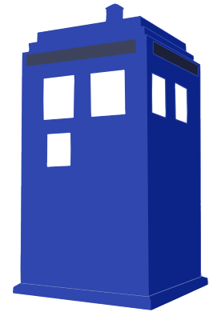

<p align="center">
	
</p>

# tardis.js

Library to mock and work with the Date object. Allows you to travel in time.

## Usage

```javascript
new Date();
// => Thu Aug 28 2014 19:47:15 GMT-0500 (Central Daylight Time)

tardis.travelToFuture(24 * 60 * 60 * 1000);
new Date();
// => Fri Aug 29 2014 19:47:15 GMT-0500 (Central Daylight Time)

tardis.travelToPast(60 * 60 * 1000);
new Date();
// => Fri Aug 29 2014 18:47:15 GMT-0500 (Central Daylight Time)

tardis.restoreTime();
new Date();
// => Thu Aug 28 2014 19:47:15 GMT-0500 (Central Daylight Time) 
```

## Notes

1. `new Date()` will create a Date value with the shifted value by the offset of how you travelled from the present.
2. `Date.now()` will have the same offset.
3. `new Date(Number)` will not present this offset -- you're creating a fixed point in time, regardless of where you travelled.
4. Travelling in the future or the past may not give you an exact millisecond difference, because of the processing time of the JavaScript instructions themselves (think of the TARDIS brakes...)

## Running tests

karma start tests/karma.config.js
